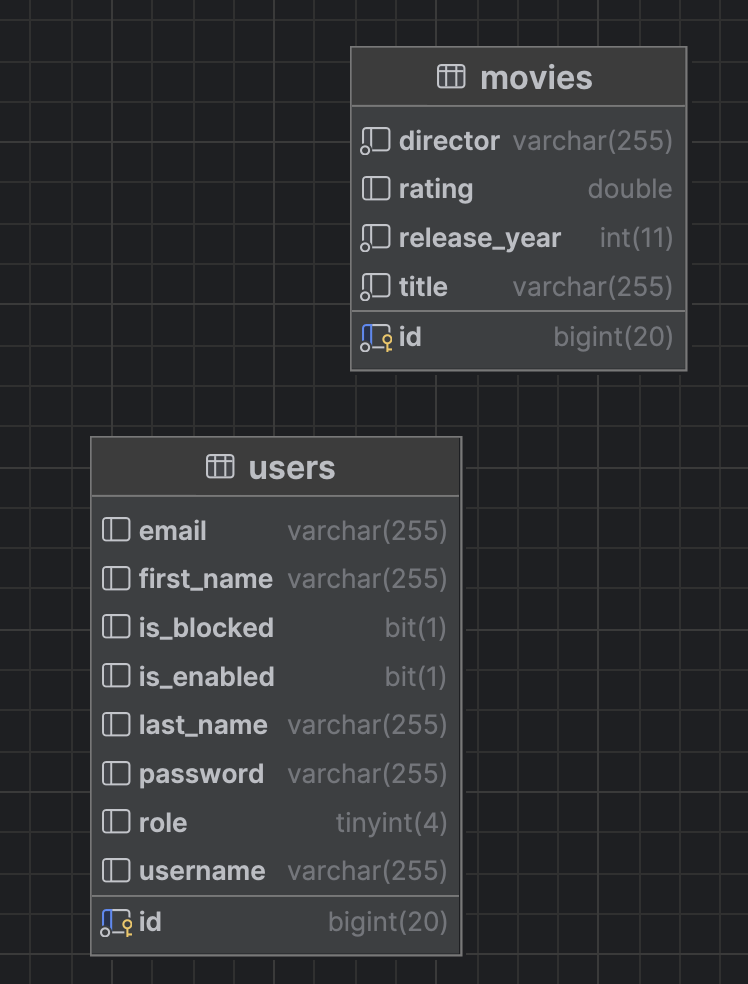

# Movie Library REST API

A secure, robust Spring Boot RESTful API for managing a digital movie library. This application features role-based access control, advanced database filtering, and intelligent asynchronous background integration with the third-party OMDb API to automatically fetch movie ratings.

## Tech Stack
* **Java 17**
* **Framework:** Spring Boot (Web, Security, Data JPA)
* **Database:** MariaDB & Hibernate (ORM)
* **Authentication:** Spring Security (HTTP Basic Auth, BCrypt Password Hashing)
* **API Documentation:** Swagger / OpenAPI 3.0
* **External API:** OMDb (Open Movie Database) API
* **Tools:** Lombok, Gradle

## Key Features
* **Role-Based Access Control:** Secure endpoints restricting access based on `USER` and `ADMIN` privileges.
* **Smart OMDb Integration:** Synchronized API calls to the OMDb API to automatically retrieve and save IMDB ratings when a new movie is added to the library.
* **Advanced Filtering:** Dynamic database queries allowing admins to search users by specific, optional criteria (username, first name, last name).
* **Secure Data Handling:** Complete BCrypt password encryption and robust JSON deserialization configurations.
* **Interactive Documentation:** A fully configured Swagger UI for easy endpoint testing and exploration.

## 🗄️ Database Schema
*(Here is the database structure powering the API:)*

[](docs/images/schema.png)

## Getting Started

### Prerequisites
* Java 17 installed
* MariaDB installed and running
* An OMDb API Key (Get one at [omdbapi.com](http://www.omdbapi.com/))

### Installation
1. Clone the repository.
2. Create a database in your local MariaDB instance:
   ```sql
   CREATE DATABASE movie_library;

### ⚙️ Configuration & Environment Variables

This application requires specific credentials to connect to the database and the external OMDb API. **For security reasons, these credentials are not included in the repository.**

Before running the application, you must configure your local environment. Open `src/main/resources/application.properties` and replace the placeholder values with your actual credentials:

```properties
# Database Configuration
spring.datasource.url=jdbc:mariadb://localhost:3306/movie_library
spring.datasource.username=YOUR_DB_USERNAME
spring.datasource.password=YOUR_DB_PASSWORD

# OMDb API Configuration 
# (You can get a free API key at [http://www.omdbapi.com/](http://www.omdbapi.com/))
omdb.api.key=YOUR_OMDB_API_KEY